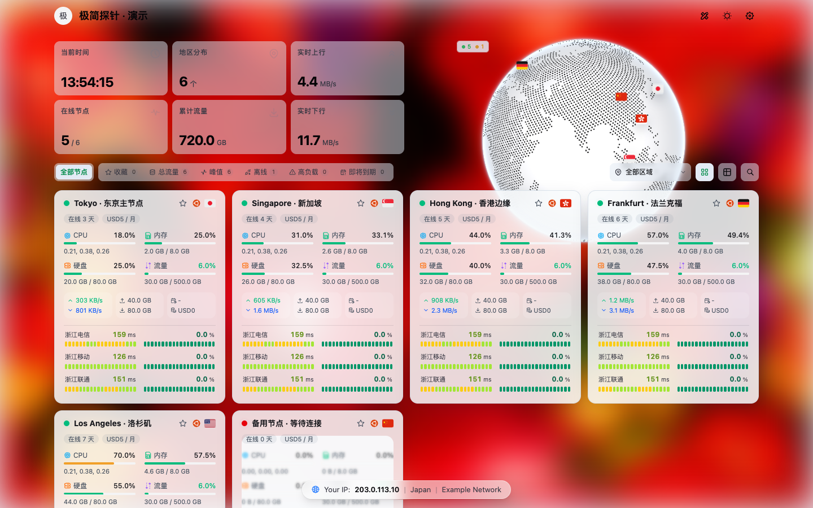

# Glassmorphism for 极简探针



将 [sanrokamlan-prog/komari-theme-Glassmorphism](https://github.com/sanrokamlan-prog/komari-theme-Glassmorphism) 原主题移植到 [极简探针 Monitor](https://github.com/monitor-probe/monitor)。基于原版 v3.3.7 的 Vue 源码、组件、样式与资源，数据改由 Monitor REST / WebSocket 接口提供，不需要 Komari 服务器。

当前版本 1.1.0，保留原项目 MIT 许可和作者署名。

## 主要功能

- **玻璃拟态外观**：动态渐变背景，翡翠 / 柔和 / 高对比 / 午夜 / 自定义配色；浅色、深色或按北京时间自动切换。背景可用图片、视频或 Bing 每日壁纸。
- **地球与地图**：贴图地球、Cobe 点阵地球、平铺世界地图，显示节点国家标记，可自动旋转或隐藏。
- **首页概览**：概览卡片可选方案并自定义顺序，支持公告（Markdown）、快捷筛选（收藏、离线、高负载、即将到期等）、区域筛选、搜索和节点收藏。
- **节点分组**：支持 Monitor 原生分组，按后台节点顺序排列并提供「未分组」入口；切换分组时概览、地球和工具面板只统计当前组。
- **节点卡片**：mini / compact / comfortable / large 四种卡片和列表视图，离线节点置底。
- **多线路延迟**：普通卡片默认显示最多 3 条探测线路，左侧为最新延迟与历史色条，右侧为最近 1 小时丢包率与历史色条；点击线路打开延迟详情。
- **节点详情**：资源负载图、延迟图、费用与剩余价值计算、节点对比和快照导出。
- **站点设置**：管理员登录后可在页面上直接调整设置并实时预览，保存到 Hub 后对所有访客生效；也可以在后台主题卡片中修改，两处共用同一份配置。支持导出、导入和恢复默认。

## 1.1.0 更新内容

- 站点设置改为保存在 Hub（需要 Monitor 1.3.0+），更新或重装主题不会丢失；设置面板仅管理员可见，支持实时预览和导入以前导出的 `glass-config.json`。
- 到期天数使用 Hub 下发的 `expires_in`，避免访客时区不同导致在线节点提前显示「已过期」。
- 支持 Monitor 原生节点分组。
- 区域筛选下拉改为与主题一致的玻璃样式，显示各区域节点数。
- 修复公告中 `&`、`<`、`>` 被重复转义的问题；公告链接只允许 `http:`、`https:`、`mailto:`。
- 移除「导入旧浏览器配置」，旧版保存在浏览器本机的配置不再读取。

## 安装

在极简探针后台「主题」→「上传主题包」，选择 [Releases](https://github.com/Gongsc/Theme-Glassmorphism/releases) 中的 `theme.tar.gz` 并启用。之后可在主题卡片上点击「从 GitHub 更新」。

## 与原版的差异

- Monitor 不公开节点 IP，地球按国家中心坐标定位，不代表机房实际位置；主题也不会把节点 IP 发送给第三方。
- 原版 GPU、自定义标签、ASN/BGP、审计日志等功能依赖 Monitor 未提供的数据：审计入口已移除，拓扑只使用公开元数据，GPU 数据不代表真实上报。
- 历史图表只包含 CPU、内存、磁盘、上下行速率和 Ping；其他历史字段留空，不用当前值或累计值填充。
- 首页配额使用本月上传 / 下载量，累计流量为生命周期总计。
- 访客信息条默认开启，会请求第三方 IP 查询服务，可在设置中关闭；汇率和图标加载同样依赖外部服务。
- 后台管理由极简探针的 `/admin/` 提供，主题包不含 Komari 后台。

## 开发

需要 Node.js 24+ 和 npm：

```sh
npm ci
npm run dev       # 开发服务器
npm run build     # 类型检查并构建
npm run lint
npm test
npm run package   # 生成 release/theme.tar.gz
```

开发服务器默认把 `/api` 代理到 `127.0.0.1:9911`；设置 `MONITOR_HUB=https://hub.example.com` 可改为代理到已开启公开状态页的现成 Hub。没有 Hub 时，另开终端运行 `python3 scripts/demo-server.py` 提供演示数据。

`preview.png` 是演示数据下 1440×900 的首页截图，访客 IP 使用示例地址；重新截图时不要记录真实访客 IP。

发布新版本：把 `theme.json`、`package.json`、`package-lock.json` 和 `vite.config.ts` 中的版本号改为同一版本，推送 `x.y.z` 格式的 tag（如 `1.1.0`），GitHub Actions 会自动构建并创建带 `theme.tar.gz` 的 Release。
