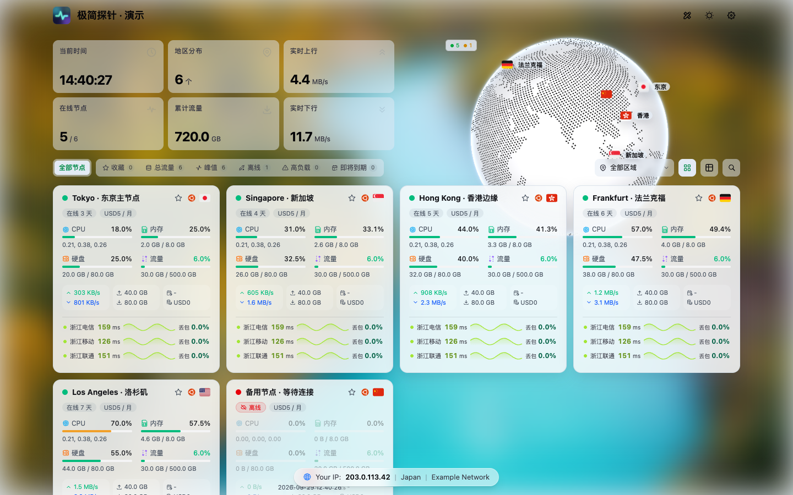

# Glassmorphism for 极简探针



本项目将 [sanrokamlan-prog/komari-theme-Glassmorphism](https://github.com/sanrokamlan-prog/komari-theme-Glassmorphism) 主题移植至 [极简探针 Monitor](https://github.com/monitor-probe/monitor)。项目基于原版 v3.3.7 的 Vue 源码、组件、样式与资源，数据改由 Monitor 的 REST 与 WebSocket 接口提供，无需部署 Komari 服务器。

当前版本为 1.3.0。本项目沿用原项目的 MIT 许可，并保留原作者署名。

## 主要功能

- **玻璃拟态外观**：提供动态渐变背景，以及翡翠、柔和、高对比、午夜和自定义五种配色；支持浅色、深色及按北京时间自动切换。背景可选用图片、视频或 Bing 每日壁纸。
- **地球与地图**：提供贴图地球、Cobe 点阵地球和平铺世界地图三种样式，标注节点所在国家，支持自动旋转或隐藏。启用「地球显示城市」后，将根据节点名称识别城市并标注城市名称。
- **首页概览**：概览卡片提供多种预设方案，并支持自定义顺序；另提供公告（支持 Markdown）、快捷筛选（收藏、离线、高负载、即将到期等）、区域筛选、搜索及节点收藏功能。
- **节点分组**：支持 Monitor 原生分组，节点按后台设定的顺序排列，并提供「未分组」入口。切换分组后，概览、地球及工具面板仅统计当前分组。
- **节点卡片**：提供 mini、compact、comfortable、large 四种卡片尺寸及列表视图，离线节点排列于末尾；离线卡片以淡化样式显示，并标注「离线」。
- **多线路延迟**：普通卡片默认显示至多 3 条探测线路，左侧为最新延迟及历史色条，右侧为最近 1 小时的丢包率及历史色条；点击线路可查看延迟详情。「卡片延迟样式」可切换为延迟曲线，悬停或点按曲线可查看对应时段的延迟与丢包率。
- **节点详情**：包含资源负载图、延迟图、费用与剩余价值计算、节点对比及数据快照导出。
- **站点图标**：可在设置中指定页面左上角、浏览器标签页和 iOS 主屏幕使用的图标，支持填写 http(s) 图片地址、站内路径，或在主题设置面板中直接上传图片；上传的图片将缩放为 180×180 并保存在站点配置中，无需另行托管。由于页面外壳为静态文件，首次加载时浏览器标签页会短暂显示内置图标。
- **站点设置**：管理员登录后可在页面中直接调整设置并实时预览，保存至 Hub 后对全部访客生效。设置亦可在后台主题卡片中修改，两处共用同一份配置，并支持导出、导入及恢复默认值。

## 1.3.0 更新内容

- 依据 Monitor 后端源码核对各项数据来源，移除 Hub 未提供数据的功能，包括 GPU、温度、自定义标签、城市与 ASN 信息、拓扑工具，以及节点详情中无有效数据的网络连接曲线、进程曲线和负载、Swap 历史曲线。相关设置项与预设方案一并移除，已保存的失效取值将自动恢复为默认值。
- 节点详情的负载图精简为 CPU、内存、磁盘和网络四项，并采用两列布局。
- 管理员登录后，节点详情页的「网络信息」区域将显示节点的 IPv4 与 IPv6 地址。地址取自 Hub 为管理面板选定的地址，位于 NAT 之后的节点显示其公网出口地址；访客无法查看。
- 主题不再将节点 IP 发送至第三方查询服务，服务商仅依据节点名称与备注识别。
- Hub 提供各时间区间内的峰值速率时，网络图将以虚线绘制上下行峰值，「近一天峰值」亦改为依据峰值计算。
- 流量配额直接采用 Hub 按计费方式计算的本周期用量 `month_used`，与后台及流量告警保持一致。

## 安装

在极简探针后台依次进入「主题」→「上传主题包」，选择 [Releases](https://github.com/Gongsc/Theme-Glassmorphism/releases) 中的 `theme.tar.gz` 并启用。此后可通过主题卡片上的「从 GitHub 更新」获取新版本。

## 与原版的差异

- **节点地址与位置**：Monitor 仅向已登录用户返回节点 IP。登录后，详情页显示 IPv4 与 IPv6 地址，搜索支持按 IP 匹配，数据导出包含地址信息；访客无法获取上述信息。地球按国家中心坐标定位节点；启用「地球显示城市」后，城市依据节点名称推断，以上位置均不代表机房的实际地理位置。服务商仅依据节点名称与备注识别，主题不会将节点 IP 发送至任何第三方。
- **已移除的功能**：原版中的 GPU、温度、自定义标签、城市与 ASN 信息、拓扑工具及审计日志依赖 Monitor 未提供的数据，均已移除。
- **历史图表**：历史数据仅包含 CPU、内存、磁盘、上下行速率及 Ping；负载、Swap、连接数和进程数仅提供实时值，不绘制历史曲线。Hub 返回各时间区间内的峰值速率（`net_rx_max` / `net_tx_max`）时，网络图以虚线绘制峰值，详情页的「近一天峰值」亦据此计算；较早版本的 Hub 不提供该数据，此时仅显示平均速率。
- **流量统计**：流量配额采用 Hub 依据节点计费方式（上行、下行、取较大值或求和）计算的本周期用量 `month_used`，与后台及流量告警保持一致；较早版本的 Hub 不提供该字段，此时主题按相同规则，依据本月上传量与下载量计算。累计流量为节点接入以来的总量。
- **外部服务**：访客信息条默认启用，该功能会请求第三方 IP 查询服务，可在设置中关闭；汇率与图标的加载同样依赖外部服务。
- **后台管理**：后台管理功能由极简探针的 `/admin/` 页面提供，主题包不包含 Komari 后台。

## 开发

开发环境需要 Node.js 24 或更高版本及 npm。常用命令如下：

```sh
npm ci
npm run dev       # 启动开发服务器
npm run build     # 执行类型检查并构建
npm run lint      # 代码检查
npm test          # 运行测试
npm run package   # 生成 release/theme.tar.gz
```

开发服务器默认将 `/api` 请求代理至 `127.0.0.1:9911`。如需连接已开启公开状态页的 Hub，可设置环境变量 `MONITOR_HUB=https://hub.example.com`。若无可用的 Hub，可在另一终端运行 `python3 scripts/demo-server.py` 以提供演示数据；设置 `DEMO_AUTHED=1` 后，演示服务将模拟管理员登录状态，并为节点提供文档保留网段中的示例地址，用于检查登录后的界面。

`preview.png` 为使用演示数据截取的 1440×900 首页截图，其中访客 IP 为示例地址。重新截图时，请勿记录真实的访客 IP。

## 发布

发布新版本时，须将 `theme.json`、`package.json`、`package-lock.json` 和 `vite.config.ts` 中的版本号统一修改为新版本号，然后推送格式为 `x.y.z` 的 tag（例如 `1.3.0`）。GitHub Actions 将自动完成构建，并创建附带 `theme.tar.gz` 的 Release。
